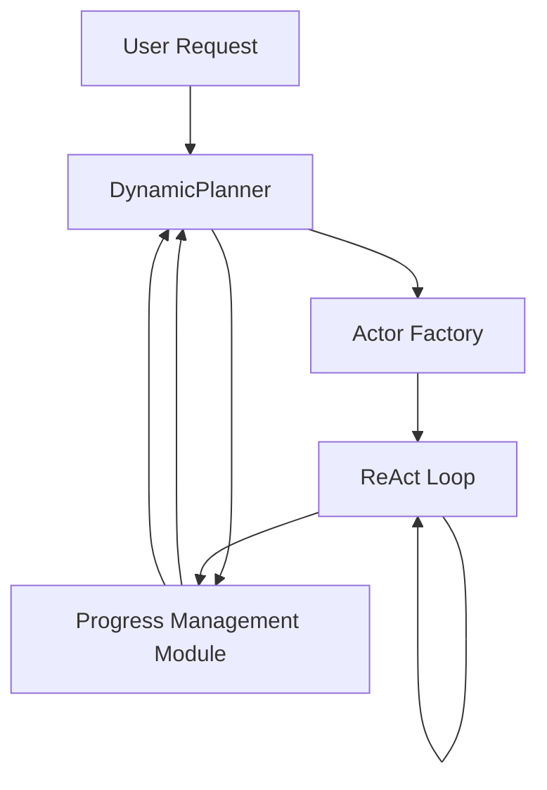

# Aime Python 框架设计文档

## 概述

本文档定义了基于论文 *AIME: TOWARDS FULLY-AUTONOMOUS MULTI-AGENT FRAMEWORK* 的Python实现设计。

**项目目标**：生产可用的Aime框架，支持动态响应式多智能体协作。

**关键设计点**：
- 基于 asyncio Actor 并发模型，每个 DynamicActor 在独立异步任务中运行
- 抽象接口层支持多LLM提供商（OpenAI、Anthropic等）
- 完整兼容MCP协议和OpenAI函数调用格式
- 四大核心组件：DynamicPlanner、ActorFactory、DynamicActor、ProgressManagementModule

## 架构设计

### 整体架构图



### 项目目录结构

```
aime/
├── __init__.py
├── base/                    # 抽象接口层
│   ├── __init__.py
│   ├── llm.py              # LLM 基础抽象
│   ├── tool.py             # 工具基础抽象
│   └── types.py            # 公共类型定义
├── components/             # 核心组件实现
│   ├── __init__.py
│   ├── dynamic_planner.py  # 动态规划器
│   ├── actor_factory.py    # Actor工厂
│   ├── dynamic_actor.py    # 动态Actor
│   └── progress_module.py  # 进度管理模块
├── providers/              # LLM提供商实现
│   ├── __init__.py
│   ├── openai.py           # OpenAI API实现
│   └── anthropic.py        # Anthropic Claude API实现
├── tools/                  # 工具系统
│   ├── __init__.py
│   ├── base.py             # BaseTool基类
│   ├── bundle.py           # 工具捆绑包
│   ├── builtin/            # 内置工具
│   │   ├── __init__.py
│   │   ├── update_progress.py  # UpdateProgress工具
│   │   ├── python_repl.py      # Python REPL
│   │   └── web_search.py       # 网页搜索
│   └── mcp_adapter.py      # MCP协议适配器
├── io/                     # 输入输出
│   ├── __init__.py
│   └── markdown.py         # Markdown进度列表解析/导出
└── templates/              # 角色提示模板
    ├── __init__.py
    └── personas.py         # 预置角色定义
```

## 核心组件设计

### 1. 进度管理模块 (Progress Management Module)

#### 数据结构

```python
@dataclass
class Task:
    id: str
    description: str
    status: TaskStatus  # pending | in_progress | completed | failed
    parent_id: Optional[str]
    completion_criteria: str
    dependencies: list[str]  # 依赖的任务ID
    created_at: datetime
    updated_at: datetime
    message: Optional[str]  # 最后更新消息
    artifacts: list[ArtifactReference]  # 产物引用

@dataclass
class ArtifactReference:
    type: str  # file | url | database | text
    path: str
    description: str

class ProgressList:
    """层次化任务进度列表，线程安全"""

    def get_task(self, task_id: str) -> Task: ...
    def add_task(self, description: str, completion_criteria: str,
                parent_id: Optional[str] = None) -> Task: ...
    def update_status(self, task_id: str, status: TaskStatus,
                     message: Optional[str] = None) -> None: ...
    def add_artifact(self, task_id: str, artifact: ArtifactReference) -> None: ...
    def get_pending_tasks(self) -> list[Task]: ...
    def get_ready_tasks(self) -> list[Task]: ...  # 依赖已满足的待处理任务
    def export_markdown(self) -> str: ...
    def subscribe(self, callback: Callable[[TaskUpdate], None]) -> Callable: ...
```

#### 设计要点

- 使用 `asyncio.Lock` 保护所有写操作，保证协程安全
- 支持事件订阅，DynamicPlanner 可以在进度更新时得到通知
- 导出Markdown格式与论文描述一致，易于人类阅读

### 2. 动态规划器 (Dynamic Planner)

```python
class DynamicPlanner:
    def __init__(
        self,
        llm: BaseLLM,
        progress_module: ProgressManagementModule,
        config: PlannerConfig = ...
    ): ...

    async def initialize(self, goal: str) -> ProgressList: ...
    """初始分解用户目标"""

    async def step(self) -> PlannerOutput: ...
    """一次规划迭代：根据当前进度决定下一步动作"""

    def is_goal_completed(self) -> bool: ...
```

**配置：**
```python
@dataclass
class PlannerConfig:
    max_iterations: int = 100
    temperature: float = 0.7
    allow_replan_on_failure: bool = True
```

**输出类型：**
```python
class PlannerOutput:
    action: PlannerAction  # DISPATCH_SUBTASK | COMPLETE | WAIT
    subtask_id: Optional[str]
    goal_summary: Optional[str]
```

#### 设计要点

- 不持有状态，状态完全存在 ProgressModule 中
- 每次迭代只决定下一步动作，支持持续动态调整
- 失败任务自动分析原因，可以插入新的应急子任务

### 3. Actor工厂 (Actor Factory)

```python
class ActorFactory:
    def __init__(
        self,
        llm: BaseLLM,
        tool_bundles: dict[str, ToolBundle],
        knowledge_base: Optional[KnowledgeBase] = None,
        environment: dict[str, str] = ...
    ): ...

    async def create_actor(
        self,
        subtask: Task,
        progress_module: ProgressManagementModule
    ) -> DynamicActor: ...
    """根据子任务需求动态创建Actor"""
```

**提示组装流程：**
```
P_t = Compose(ρ_t, desc(T_t), κ_t, ε, Γ)

ρ_t: 角色 (Persona) - 根据任务生成专业角色
desc(T_t): 所选工具包中工具的描述
κ_t: 从知识库检索的相关知识
ε: 环境上下文（当前时间、权限等）
Γ: 输出格式要求
```

#### 设计要点

- 工具捆绑包预打包，避免扁平列表选择效率低下
- 支持从知识库动态检索知识注入提示
- 每个Actor都是新鲜实例，用完可销毁

### 4. 动态Actor (Dynamic Actor)

```python
class DynamicActor:
    def __init__(
        self,
        llm: BaseLLM,
        task: Task,
        toolkit: Toolkit,
        system_prompt: str,
        progress_module: ProgressManagementModule
    ): ...

    async def run(self) -> ActorResult: ...
    """运行ReAct循环直到任务完成"""
```

**ReAct循环：**
```python
while not completion_criteria_met:
    1. Reasoning: LLM分析历史，决定下一步动作
    2. Action: 调用工具
    3. Observation: 获取工具返回结果
    4. (可选) UpdateProgress: 主动汇报进度
```

**ActorResult：**
```python
@dataclass
class ActorResult:
    task_id: str
    status: TaskStatus
    summary: str
    artifacts: list[ArtifactReference]
```

#### 设计要点

- 每个Actor运行在独立的 `asyncio.Task`
- 自主决定何时汇报进度，不需要Planner轮询
- 遵循论文中的ReAct范式，推理和行动交替

## LLM抽象层设计

### BaseLLM接口

```python
@dataclass
class Message:
    role: str  # "system" | "user" | "assistant" | "tool"
    content: str
    tool_calls: Optional[list[ToolCall]] = None
    tool_call_id: Optional[str] = None

@dataclass
class LLMResponse:
    content: str
    tool_calls: list[ToolCall]
    usage: UsageInfo

@dataclass
class ToolCall:
    id: str
    name: str
    arguments: dict

class BaseLLM(ABC):
    @abstractmethod
    async def generate(
        self,
        messages: list[Message],
        temperature: float = 0.7,
        max_tokens: Optional[int] = None
    ) -> LLMResponse: ...

    @abstractmethod
    def supports_streaming(self) -> bool: ...

    @abstractmethod
    async def generate_stream(
        self,
        messages: list[Message],
        temperature: float = 0.7,
        max_tokens: Optional[int] = None
    ) -> AsyncIterator[LLMResponseChunk]: ...
```

### 提供商实现

| 提供商 | 状态 |
|--------|------|
| OpenAI API | ✅ 计划实现 |
| Anthropic Claude | ✅ 计划实现 |
| 兼容OpenAI格式的第三方 | ✅ 可通过OpenAI实现适配 |

## 工具系统设计

### BaseTool接口

```python
@dataclass
class ToolResult:
    success: bool
    content: str
    artifacts: list[ArtifactReference] = field(default_factory=list)

class BaseTool(ABC):
    @property
    @abstractmethod
    def name(self) -> str: ...

    @property
    @abstractmethod
    def description(self) -> str: ...

    @property
    @abstractdef parameters_schema(self) -> dict: ...
    """JSON Schema for parameters"""

    @abstractmethod
    async def __call__(self, params: dict) -> ToolResult: ...
```

### 工具捆绑包 (ToolBundle)

```python
class ToolBundle:
    """一组功能相关的工具打包在一起"""

    def __init__(self, name: str, description: str, tools: list[BaseTool]): ...

    @property
    def name(self) -> str: ...
    @property
    def description(self) -> str: ...
    def get_tools(self) -> list[BaseTool]: ...
```

ActorFactory 根据子任务描述选择合适的捆绑包组合成最终工具集。

### 内置工具

| 工具 | 功能 |
|------|------|
| `update_progress` | 汇报进度到进度管理模块（系统提供） |
| `python_repl` | 执行Python代码 |
| `web_search` | 网页搜索 |
| `read_file` | 读取文件 |
| `write_file` | 写入文件 |

### 兼容性

- ✅ 原生支持 OpenAI 函数调用格式
- ✅ MCP (Model Context Protocol) 适配器，可接入外部MCP服务

## 并发模型

基于 `asyncio` 的Actor模式：

1. **主协程**：DynamicPlanner 运行，等待进度更新事件
2. **每个DynamicActor**：在独立的 `asyncio.Task` 中运行ReAct循环
3. **状态共享**：只通过 ProgressManagementModule 共享状态
4. **同步**：所有写操作由 `asyncio.Lock` 保护

优点：
- 真正并行执行，多个Actor可同时工作
- 异步I/O，LLM调用不阻塞其他Actor
- 架构简洁，Actor之间完全解耦

## 错误处理

| 错误场景 | 处理策略 |
|---------|----------|
| 单个子任务失败 | Planner分析失败原因，可创建新的重试子任务 |
| LLM API超时/限流 | 指数退避重试，可配置最大重试次数 |
| 工具参数错误 | Actor捕获错误，反馈给LLM自动修正 |
| Planner迭代次数超限 | 终止整个任务，报告失败 |
| 状态更新冲突 | asyncio.Lock 保证序列化，避免竞态条件 |

## 可观测性

- Rich 终端美化，实时显示进度树
- 可选追踪日志，记录所有LLM请求和响应
- 可导出完整执行轨迹用于调试

## 依赖项

主要依赖：
- `asyncio` - Python标准库，用于异步并发
- `pydantic` - 数据验证
- `openai` - OpenAI API客户端
- `anthropic` - Anthropic API客户端
- `rich` - 终端输出美化
- `mcp` - 可选，MCP协议支持

## 参考论文

- AIME: TOWARDS FULLY-AUTONOMOUS MULTI-AGENT FRAMEWORK, arXiv:2507.11988
